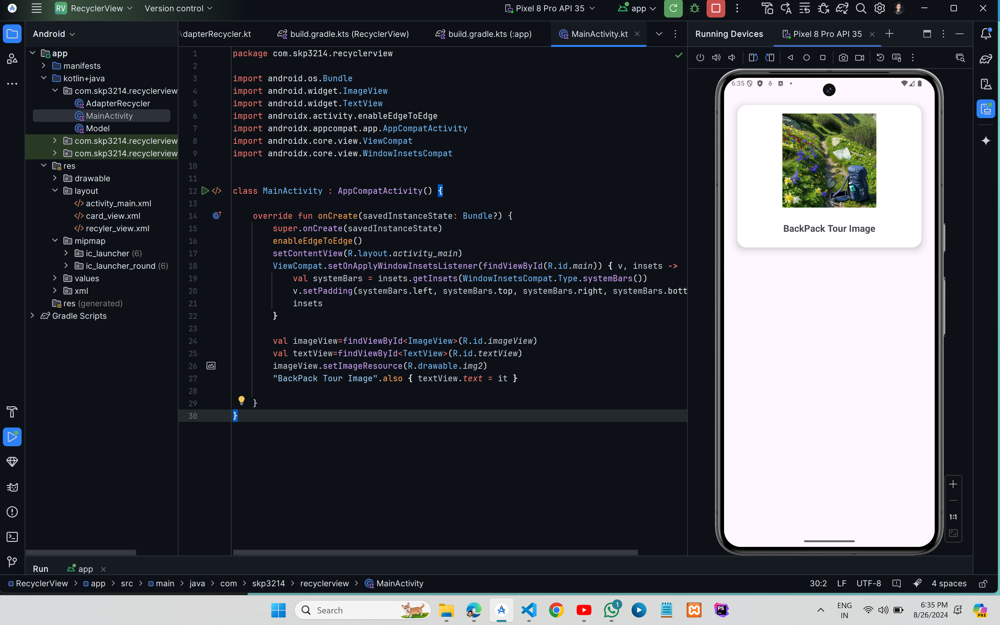

# CardView In Android


## XML Code

### `activity_main.xml`

```xml
<?xml version="1.0" encoding="utf-8"?>
<RelativeLayout xmlns:android="http://schemas.android.com/apk/res/android"
    xmlns:tools="http://schemas.android.com/tools"
    android:layout_width="match_parent"
    android:layout_height="match_parent"
    android:id="@+id/main"
    xmlns:app="http://schemas.android.com/apk/res-auto"
    tools:context=".MainActivity">

    <androidx.cardview.widget.CardView
        android:layout_width="match_parent"
        android:layout_height="wrap_content"
        app:cardElevation="10dp"
        app:cardCornerRadius="20dp"
        android:layout_margin="10dp"
        app:cardBackgroundColor="@color/white"
        app:cardMaxElevation="12dp"
        app:cardPreventCornerOverlap="true"
        app:cardUseCompatPadding="true"
        >
        <LinearLayout
            android:layout_width="match_parent"
            android:layout_height="match_parent"
            android:padding="8dp"
            android:orientation="vertical">
        <ImageView
            android:layout_width="200dp"
            android:layout_height="200dp"
            android:layout_gravity="center"
            android:layout_margin="10dp"
            android:id="@+id/imageView"
            android:contentDescription="@string/app_name" />

        <TextView
            android:layout_width="wrap_content"
            android:layout_height="wrap_content"
            android:id="@+id/textView"
            android:layout_gravity="bottom|center_horizontal"
            android:layout_marginTop="20dp"
            android:layout_marginBottom="20dp"
            android:textSize="20sp"
            android:textStyle="bold"
            />

        </LinearLayout>


    </androidx.cardview.widget.CardView>

</RelativeLayout>
```

## Kotlin Code

### `MainActivity.kt`

```kt
import android.os.Bundle
import android.widget.ImageView
import android.widget.TextView
import androidx.activity.enableEdgeToEdge
import androidx.appcompat.app.AppCompatActivity
import androidx.core.view.ViewCompat
import androidx.core.view.WindowInsetsCompat


class MainActivity : AppCompatActivity() {

    override fun onCreate(savedInstanceState: Bundle?) {
        super.onCreate(savedInstanceState)
        enableEdgeToEdge()
        setContentView(R.layout.activity_main)
        ViewCompat.setOnApplyWindowInsetsListener(findViewById(R.id.main)) { v, insets ->
            val systemBars = insets.getInsets(WindowInsetsCompat.Type.systemBars())
            v.setPadding(systemBars.left, systemBars.top, systemBars.right, systemBars.bottom)
            insets
        }

        val imageView=findViewById<ImageView>(R.id.imageView)
        val textView=findViewById<TextView>(R.id.textView)
        imageView.setImageResource(R.drawable.img2)
        "BackPack Tour Image".also { textView.text = it }

    }
}
```

