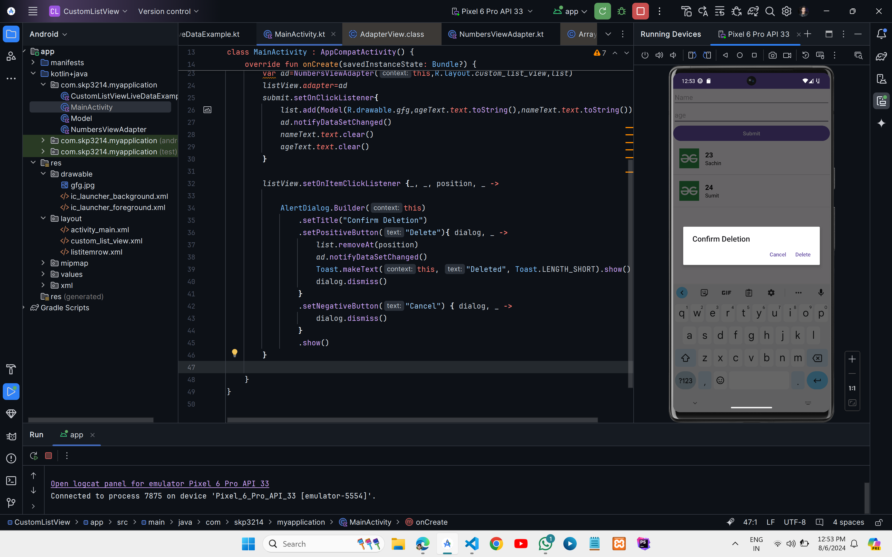
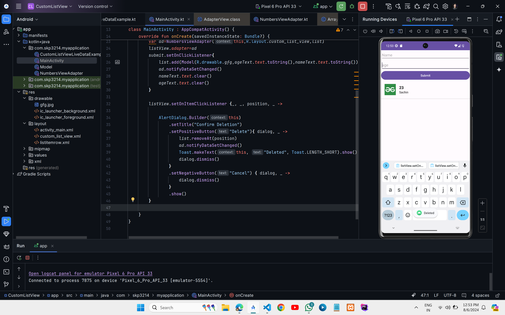

## Custom List View Live Data Input Using Base Adapter






### XML Code
### `activity_main.xml`

```xml
<?xml version="1.0" encoding="utf-8"?>
<LinearLayout xmlns:android="http://schemas.android.com/apk/res/android"
    android:layout_width="match_parent"
    android:layout_height="match_parent"
    xmlns:tools="http://schemas.android.com/tools"
    android:orientation="vertical"
    tools:context=".MainActivity">
    <EditText
        android:layout_width="match_parent"
        android:layout_height="wrap_content"
        android:id="@+id/et1"
        android:hint="Name"
        />

    <EditText
        android:id="@+id/et2"
        android:layout_width="match_parent"
        android:layout_height="wrap_content"
        android:hint="age"
        android:minHeight="48dp" />
    <Button
        android:layout_width="match_parent"
        android:layout_height="wrap_content"
        android:text="Submit"
        android:id="@+id/add"
        />
    <ListView
        android:id="@+id/listView"
        android:layout_width="match_parent"
        android:layout_height="match_parent"
        />

</LinearLayout>

```

### `custom_list_view.xml`

```xml
<?xml version="1.0" encoding="utf-8"?>
<LinearLayout
    xmlns:android="http://schemas.android.com/apk/res/android"
    xmlns:tools="http://schemas.android.com/tools"
    android:layout_width="match_parent"
    android:layout_height="wrap_content"
    android:orientation="horizontal"

    tools:ignore="UselessParent">

    <ImageView
        android:id="@+id/imageView"
        android:layout_width="84dp"
        android:layout_height="84dp"
        android:padding="16dp"
        tools:ignore="ContentDescription" />

    <LinearLayout
        android:layout_width="match_parent"
        android:layout_height="match_parent"
        android:gravity="center_vertical"
        android:orientation="vertical">

        <TextView
            android:id="@+id/textView1"
            android:layout_width="match_parent"
            android:layout_height="wrap_content"
            android:layout_marginTop="16dp"
            android:gravity="bottom|left"
            android:textColor="@android:color/black"
            android:textSize="18sp"
            android:textStyle="bold"
            tools:ignore="RtlHardcoded" />

        <TextView
            android:id="@+id/textView2"
            android:layout_width="match_parent"
            android:layout_height="wrap_content"
            android:layout_marginBottom="16dp"
            android:gravity="top|left"
            android:textColor="@android:color/black"
            android:textSize="14sp"
            tools:ignore="RtlHardcoded" />

    </LinearLayout>

</LinearLayout>
```
---
### Kotlin Code

### `Model.kt`

```kt
class Model(val numbersImageId: Int, val numberInDigit: String, val numbersInText: String)
```
### `NumbersViewAdapter.kt`

```kt
import android.content.Context
import android.view.LayoutInflater
import android.view.View
import android.view.ViewGroup
import android.widget.BaseAdapter
import android.widget.ImageView
import android.widget.TextView

class NumbersViewAdapter(context: Context, private val arrayList: MutableList<Model>) : BaseAdapter() {

    private val inflater: LayoutInflater = LayoutInflater.from(context)

    override fun getCount(): Int {return arrayList.size
    }

    override fun getItem(position: Int): Model {
        return arrayList[position]
    }

    override fun getItemId(position: Int): Long {
        return position.toLong()
    }

    override fun getView(position: Int, convertView: View?, parent: ViewGroup): View {
        val view: View = convertView ?: inflater.inflate(R.layout.custom_list_view, parent, false)

        val currentNumberPosition = getItem(position)
        val numbersImage = view.findViewById<ImageView>(R.id.imageView)
        numbersImage.setImageResource(currentNumberPosition.numbersImageId)

        val textView1 = view.findViewById<TextView>(R.id.textView1)
        textView1.text = currentNumberPosition.numberInDigit

        val textView2 = view.findViewById<TextView>(R.id.textView2)
        textView2.text = currentNumberPosition.numbersInText

        return view
    }
}
```
### `MainActivity.kt`
```kt
package com.skp3214.myapplication

import android.os.Bundle
import android.widget.Button
import android.widget.EditText
import android.widget.ListView
import android.widget.Toast
import androidx.appcompat.app.AlertDialog
import androidx.appcompat.app.AppCompatActivity


class MainActivity : AppCompatActivity() {
    override fun onCreate(savedInstanceState: Bundle?) {
        super.onCreate(savedInstanceState)
        setContentView(R.layout.activity_main)
        val listView=findViewById<ListView>(R.id.listView)
        val nameText=findViewById<EditText>(R.id.et1)
        val ageText=findViewById<EditText>(R.id.et2)
        val submit=findViewById<Button>(R.id.add)
        val list= mutableListOf<Model>()

        val ad=NumbersViewAdapter(this, list)
        listView.adapter=ad
        submit.setOnClickListener{
            list.add(Model(R.drawable.gfg,ageText.text.toString(),nameText.text.toString()))
            ad.notifyDataSetChanged()
            nameText.text.clear()
            ageText.text.clear()
        }

        listView.setOnItemClickListener {_, _, position, _ ->

            AlertDialog.Builder(this)
                .setTitle("Confirm Deletion")
                .setPositiveButton("Delete"){ dialog, _ ->
                    list.removeAt(position)
                    ad.notifyDataSetChanged()
                    Toast.makeText(this, "Deleted", Toast.LENGTH_SHORT).show()
                    dialog.dismiss()
                }
                .setNegativeButton("Cancel") { dialog, _ ->
                    dialog.dismiss()
                }
                .show()
        }

    }
}
```