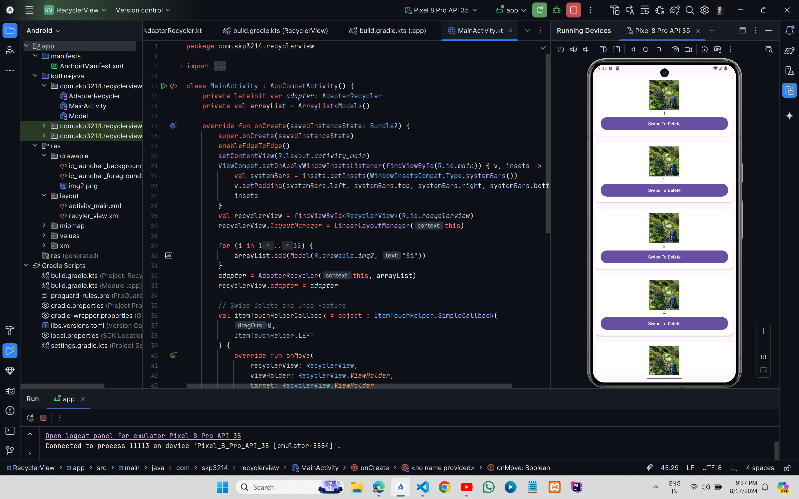
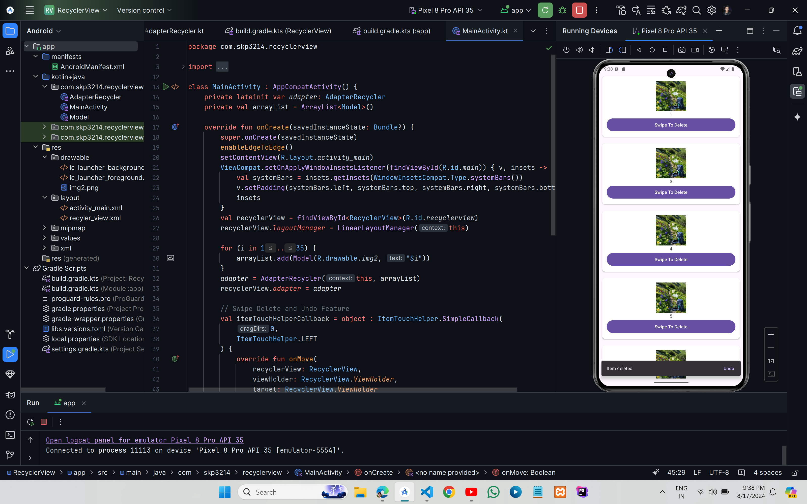

# Swipe To Delete & Undo in Android RecyclerView


### ` Item 2 Deleted `


## XML Code

### `activity_main.xml`

```xml
<?xml version="1.0" encoding="utf-8"?>
<RelativeLayout xmlns:android="http://schemas.android.com/apk/res/android"
    xmlns:tools="http://schemas.android.com/tools"
    android:id="@+id/main"
    android:layout_width="match_parent"
    android:layout_height="match_parent"
    tools:context=".MainActivity">

    <androidx.recyclerview.widget.RecyclerView
        android:layout_width="match_parent"
        android:layout_height="match_parent"
        android:id="@+id/recyclerview"/>

</RelativeLayout>
```

### `recycler_view.xml`

```xml
<?xml version="1.0" encoding="utf-8"?>
<LinearLayout xmlns:android="http://schemas.android.com/apk/res/android"
    android:layout_width="match_parent"
    android:layout_height="wrap_content"
    xmlns:app="http://schemas.android.com/apk/res-auto"
    android:padding="6dp"
    android:orientation="horizontal">

    <androidx.cardview.widget.CardView
        android:layout_width="match_parent"
        android:layout_height="wrap_content"
        app:cardCornerRadius="10dp"
        app:contentPadding="6dp"
        android:layout_margin="4dp"
        android:scrollbars="vertical"
        android:focusable="true">

        <LinearLayout
            android:layout_width="match_parent"
            android:layout_height="match_parent"
            android:padding="8dp"
            android:orientation="vertical">

            <ImageView
                android:id="@+id/imageView"
                android:layout_width="96dp"
                android:layout_height="94dp"
                android:layout_gravity="center"
                android:contentDescription="TODO" />

            <TextView
                android:id="@+id/textView"
                android:layout_width="wrap_content"
                android:layout_height="wrap_content"
                android:layout_gravity="center" />
            <Button
                android:layout_width="match_parent"
                android:id="@+id/btn"
                android:text="Swipe To Delete"
                android:layout_height="wrap_content"/>
        </LinearLayout>
    </androidx.cardview.widget.CardView>

</LinearLayout>
```

## Kotlin Code

### `MainActivity.kt`

```kt
import android.os.Bundle
import androidx.activity.enableEdgeToEdge
import androidx.appcompat.app.AppCompatActivity
import androidx.core.view.ViewCompat
import androidx.core.view.WindowInsetsCompat
import androidx.recyclerview.widget.ItemTouchHelper
import androidx.recyclerview.widget.LinearLayoutManager
import androidx.recyclerview.widget.RecyclerView
import com.google.android.material.snackbar.Snackbar

class MainActivity : AppCompatActivity() {
    private lateinit var adapter: AdapterRecycler
    private val arrayList = ArrayList<Model>()

    override fun onCreate(savedInstanceState: Bundle?) {
        super.onCreate(savedInstanceState)
        enableEdgeToEdge()
        setContentView(R.layout.activity_main)
        ViewCompat.setOnApplyWindowInsetsListener(findViewById(R.id.main)) { v, insets ->
            val systemBars = insets.getInsets(WindowInsetsCompat.Type.systemBars())
            v.setPadding(systemBars.left, systemBars.top, systemBars.right, systemBars.bottom)
            insets
        }
        val recyclerView = findViewById<RecyclerView>(R.id.recyclerview)
        recyclerView.layoutManager = LinearLayoutManager(this)

        for (i in 1..35) {
            arrayList.add(Model(R.drawable.img2, "$i"))
        }
        adapter = AdapterRecycler(this, arrayList)
        recyclerView.adapter = adapter

        // Swipe Delete and Undo Feature
        val itemTouchHelperCallback = object : ItemTouchHelper.SimpleCallback(
            0,
            ItemTouchHelper.LEFT
        ) {
            override fun onMove(
                recyclerView: RecyclerView,
                viewHolder: RecyclerView.ViewHolder,
                target: RecyclerView.ViewHolder
            ): Boolean {
                return false
            }

            override fun onSwiped(viewHolder: RecyclerView.ViewHolder, direction: Int) {
                val position = viewHolder.bindingAdapterPosition
                val deletedModel = arrayList[position]
                arrayList.removeAt(position)
                adapter.notifyItemRemoved(position)

                Snackbar.make(
                    findViewById(R.id.recyclerview),
                    "Item deleted",
                    Snackbar.LENGTH_LONG
                ).setAction("Undo") {arrayList.add(position, deletedModel)
                    adapter.notifyItemInserted(position)
                }.show()
            }
        }

        val itemTouchHelper = ItemTouchHelper(itemTouchHelperCallback)
        itemTouchHelper.attachToRecyclerView(recyclerView)
    }
}
```

### `AdapterRecycler.kt`

```kt
import android.content.Context
import android.view.LayoutInflater
import android.view.View
import android.view.ViewGroup
import android.widget.Button
import android.widget.ImageView
import android.widget.TextView
import android.widget.Toast
import androidx.recyclerview.widget.RecyclerView

class AdapterRecycler(private val context:Context, private val arrayList:ArrayList<Model>):RecyclerView.Adapter<AdapterRecycler.MyHolder>(){

    override fun onCreateViewHolder(parent: ViewGroup, viewType: Int): MyHolder {
        val view=LayoutInflater.from(context).inflate(R.layout.recyler_view,parent,false)
        return MyHolder(view)
    }

    override fun onBindViewHolder(holder: MyHolder, position: Int) {
        val item = arrayList[position]
        holder.image.setImageResource(item.image)
        holder.textView.text = item.text
    }

    override fun getItemCount(): Int {
        return arrayList.size
    }

    class MyHolder(view: View):RecyclerView.ViewHolder(view){
        val image: ImageView = view.findViewById(R.id.imageView)
        val textView: TextView = view.findViewById(R.id.textView)
    }

}
```

### `Model.kt`

```kt
class Model (val image:Int,val text:String)
```