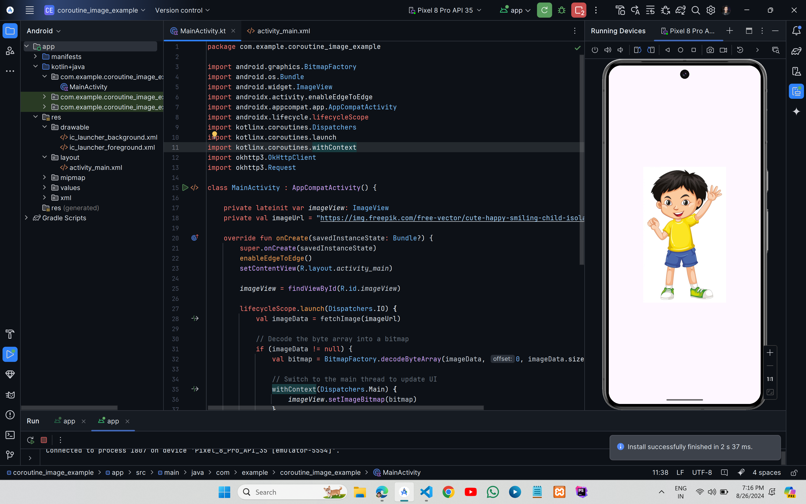

# Live Image Fetch Using Kotlin Coroutine



## XML Code

### `activity_main.xml`

```xml
<?xml version="1.0" encoding="utf-8"?>
<LinearLayout xmlns:android="http://schemas.android.com/apk/res/android"
    android:orientation="vertical"
    android:layout_width="match_parent"
    android:layout_height="match_parent"
    android:gravity="center">

    <ImageView
        android:id="@+id/imageView"
        android:layout_width="400dp"
        android:layout_height="400dp"
        android:contentDescription="Image description"/>

</LinearLayout>
```
## Kotlin Code

### `MainActivity.kt`

```kt
import android.graphics.BitmapFactory
import android.os.Bundle
import android.widget.ImageView
import androidx.activity.enableEdgeToEdge
import androidx.appcompat.app.AppCompatActivity
import androidx.lifecycle.lifecycleScope
import kotlinx.coroutines.Dispatchers
import kotlinx.coroutines.launch
import kotlinx.coroutines.withContext
import okhttp3.OkHttpClient
import okhttp3.Request

class MainActivity : AppCompatActivity() {

    private lateinit var imageView: ImageView
    private val imageUrl = "https://img.freepik.com/free-vector/cute-happy-smiling-child-isolated-white_1308-32243.jpg"

    override fun onCreate(savedInstanceState: Bundle?) {
        super.onCreate(savedInstanceState)
        enableEdgeToEdge()
        setContentView(R.layout.activity_main)

        imageView = findViewById(R.id.imageView)

        lifecycleScope.launch(Dispatchers.IO) {
            val imageData = fetchImage(imageUrl)

            // Decode the byte array into a bitmap
            if (imageData != null) {
                val bitmap = BitmapFactory.decodeByteArray(imageData, 0, imageData.size)

                // Switch to the main thread to update UI
                withContext(Dispatchers.Main) {
                    imageView.setImageBitmap(bitmap)
                }
            }
        }
    }

    private suspend fun fetchImage(url: String): ByteArray? {
        return withContext(Dispatchers.IO) {
            val client = OkHttpClient()
            val request = Request.Builder().url(url).build()
            val response = client.newCall(request).execute()

            if (response.isSuccessful) {
                response.body?.bytes()
            } else {
                null
            }
        }
    }
}
```
