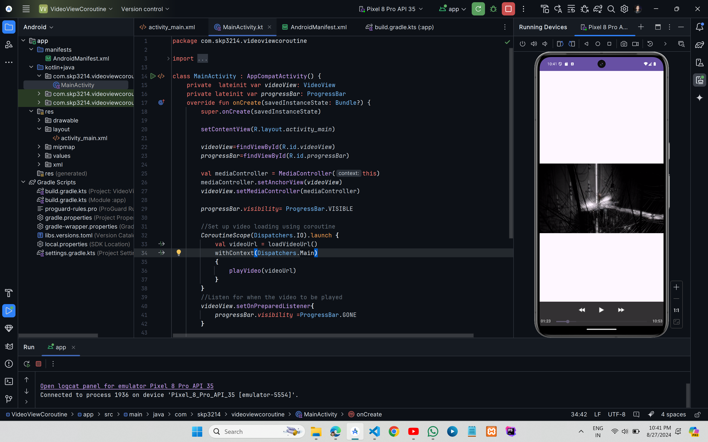

# Live Video Fetch Using Kotlin Coroutine


## XML Code

### `AndroidManifest.xml`

```xml
<?xml version="1.0" encoding="utf-8"?>
<manifest xmlns:android="http://schemas.android.com/apk/res/android"
    xmlns:tools="http://schemas.android.com/tools">
    <!-- add only below line for internet permission -->
    <uses-permission android:name="android.permission.INTERNET" /> 
    <application
        android:allowBackup="true"
        android:dataExtractionRules="@xml/data_extraction_rules"
        android:fullBackupContent="@xml/backup_rules"
        android:icon="@mipmap/ic_launcher"
        android:label="@string/app_name"
        android:roundIcon="@mipmap/ic_launcher_round"
        android:supportsRtl="true"
        android:theme="@style/Theme.VideoViewCoroutine"
        tools:targetApi="31">
        <activity
            android:name=".MainActivity"
            android:exported="true">
            <intent-filter>
                <action android:name="android.intent.action.MAIN" />

                <category android:name="android.intent.category.LAUNCHER" />
            </intent-filter>
        </activity>
    </application>

</manifest>
```

### `activity_main.xml`

```xml
<?xml version="1.0" encoding="utf-8"?>
<RelativeLayout xmlns:android="http://schemas.android.com/apk/res/android"
    android:layout_width="match_parent"
    android:id="@+id/main"
    android:layout_height="match_parent">

    <VideoView
        android:id="@+id/videoView"
        android:layout_width="match_parent"
        android:layout_height="match_parent"
        android:layout_centerInParent="true" />

    <ProgressBar
        android:id="@+id/progressBar"
        android:layout_width="wrap_content"
        android:layout_height="wrap_content"
        android:layout_centerInParent="true"
        android:visibility="visible" />

</RelativeLayout>
```

## Kotlin Code

### `MainActivity.kt`

```kt

import android.os.Bundle
import android.widget.MediaController
import android.widget.ProgressBar
import android.widget.VideoView
import androidx.appcompat.app.AppCompatActivity
import kotlinx.coroutines.CoroutineScope
import kotlinx.coroutines.Dispatchers
import kotlinx.coroutines.delay
import kotlinx.coroutines.launch
import kotlinx.coroutines.withContext

class MainActivity : AppCompatActivity() {
    private  lateinit var videoView: VideoView
    private lateinit var progressBar: ProgressBar
    override fun onCreate(savedInstanceState: Bundle?) {
        super.onCreate(savedInstanceState)

        setContentView(R.layout.activity_main)

        videoView=findViewById(R.id.videoView)
        progressBar=findViewById(R.id.progressBar)

        val mediaController = MediaController(this)
        mediaController.setAnchorView(videoView)
        videoView.setMediaController(mediaController)

        progressBar.visibility= ProgressBar.VISIBLE

        //Set up video loading using coroutine
        CoroutineScope(Dispatchers.IO).launch {
            val videoUrl = loadVideoUrl()
            withContext(Dispatchers.Main)
            {
                playVideo(videoUrl)
            }
        }
        //Listen for when the video to be played
        videoView.setOnPreparedListener{
            progressBar.visibility =ProgressBar.GONE
        }

    }
    private  suspend fun loadVideoUrl():String {
        delay(1000)
        return "https://commondatastorage.googleapis.com/gtv-videos-bucket/sample/ElephantsDream.mp4"
    }
    private fun playVideo(videoURL:String)
    {
        videoView.setVideoPath(videoURL)
        videoView.start()
    }
}