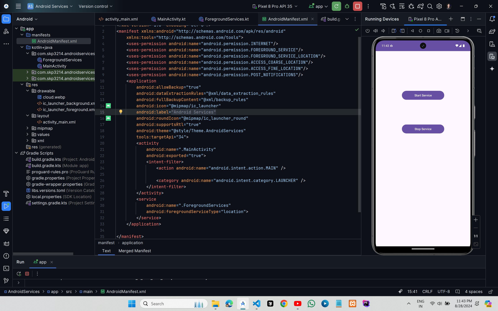
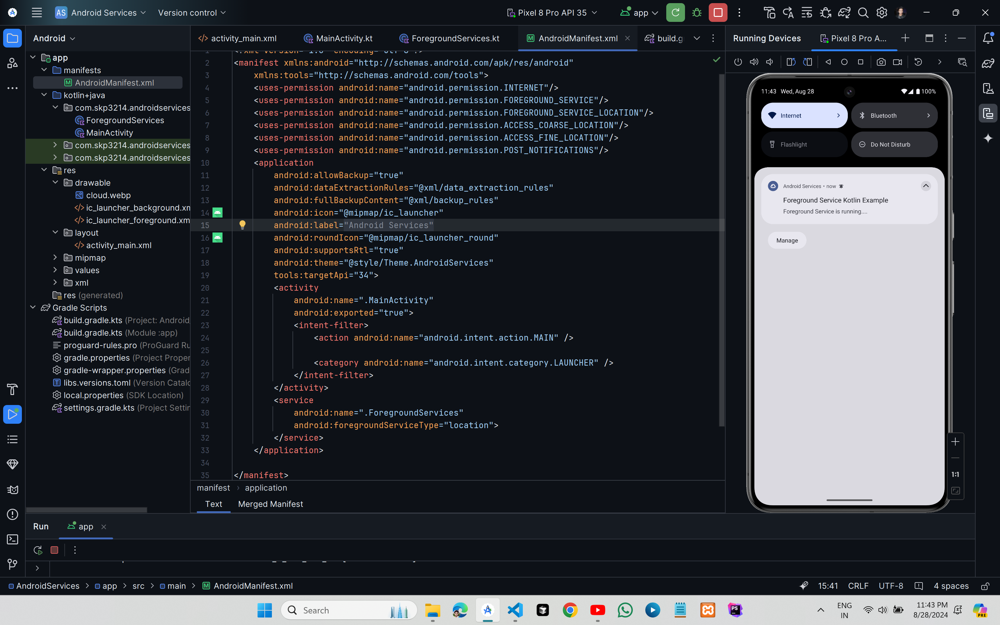

# Foreground Service in Android





## XML Code

### `AndroidManifest.xml`

```xml
<?xml version="1.0" encoding="utf-8"?>
<manifest xmlns:android="http://schemas.android.com/apk/res/android"
    xmlns:tools="http://schemas.android.com/tools">
    <uses-permission android:name="android.permission.INTERNET"/>
    <uses-permission android:name="android.permission.FOREGROUND_SERVICE"/>
    <uses-permission android:name="android.permission.FOREGROUND_SERVICE_LOCATION"/>
    <uses-permission android:name="android.permission.ACCESS_COARSE_LOCATION"/>
    <uses-permission android:name="android.permission.ACCESS_FINE_LOCATION"/>
    <uses-permission android:name="android.permission.POST_NOTIFICATIONS"/>
    <application
        android:allowBackup="true"
        android:dataExtractionRules="@xml/data_extraction_rules"
        android:fullBackupContent="@xml/backup_rules"
        android:icon="@mipmap/ic_launcher"
        android:label="@string/app_name"
        android:roundIcon="@mipmap/ic_launcher_round"
        android:supportsRtl="true"
        android:theme="@style/Theme.AndroidServices"
        tools:targetApi="34">
        <activity
            android:name=".MainActivity"
            android:exported="true">
            <intent-filter>
                <action android:name="android.intent.action.MAIN" />

                <category android:name="android.intent.category.LAUNCHER" />
            </intent-filter>
        </activity>
        <service
            android:name=".ForegroundServices"
            android:foregroundServiceType="location">
        </service>
    </application>

</manifest>
```
### `activity_main.xml`

```xml
<?xml version="1.0" encoding="utf-8"?>
<androidx.constraintlayout.widget.ConstraintLayout xmlns:android="http://schemas.android.com/apk/res/android"
    xmlns:app="http://schemas.android.com/apk/res-auto"
    xmlns:tools="http://schemas.android.com/tools"
    android:id="@+id/main"
    android:layout_width="match_parent"
    android:layout_height="match_parent"
    tools:context=".MainActivity">

    <Button
        android:id="@+id/startButton"
        android:layout_width="200dp"
        android:layout_height="50dp"
        android:layout_marginTop="184dp"
        android:text="Start Service"
        app:layout_constraintEnd_toEndOf="parent"
        app:layout_constraintStart_toStartOf="parent"
        app:layout_constraintTop_toTopOf="parent" />

    <Button
        android:id="@+id/stopButton"
        android:layout_width="200dp"
        android:layout_height="50dp"
        android:layout_marginTop="108dp"
        android:text="Stop Service"
        app:layout_constraintBottom_toBottomOf="parent"
        app:layout_constraintEnd_toEndOf="parent"
        app:layout_constraintStart_toStartOf="parent"
        app:layout_constraintTop_toBottomOf="@+id/startButton"
        app:layout_constraintVertical_bias="0.002" />
</androidx.constraintlayout.widget.ConstraintLayout>
```

## Kotlin Code

### `MainActivity.kt`

```kt
package com.skp3214.androidservices

import android.content.Intent
import android.os.Bundle
import android.widget.Button
import androidx.appcompat.app.AppCompatActivity
import androidx.core.content.ContextCompat


class MainActivity : AppCompatActivity() {
    override fun onCreate(savedInstanceState: Bundle?) {
        super.onCreate(savedInstanceState)
        setContentView(R.layout.activity_main)

        val startButton=findViewById<Button>(R.id.startButton)
        val stopButton=findViewById<Button>(R.id.stopButton)

        startButton.setOnClickListener {
            val startIntent=Intent(this, ForegroundServices::class.java)
            startIntent.putExtra("inputExtra","Foreground Service is running....")
            ContextCompat.startForegroundService(this,startIntent)
        }

        stopButton.setOnClickListener {
            val stopIntent=Intent(this,ForegroundServices::class.java)
            stopService(stopIntent)
        }
    }
}
```
### `ForegroundServices.kt`

```kt
package com.skp3214.androidservices

import android.app.NotificationChannel
import android.app.NotificationManager
import android.app.PendingIntent
import android.app.PendingIntent.FLAG_IMMUTABLE
import android.app.Service
import android.content.Intent
import android.content.pm.ServiceInfo.FOREGROUND_SERVICE_TYPE_LOCATION
import android.os.IBinder
import androidx.core.app.NotificationCompat


class ForegroundServices : Service() {
    private val channelID = "ForegroundService Kotlin"

    override fun onStartCommand(intent: Intent?, flags: Int, startId: Int): Int {
        val input = intent?.getStringExtra("inputExtra")

        createNotificationChannel()
        val notificationIntent = Intent(this, MainActivity::class.java)

        val pendingIntent = PendingIntent.getActivity(this,
            0, notificationIntent, FLAG_IMMUTABLE)

        val notification = NotificationCompat.Builder(this, channelID)
            .setContentTitle("Foreground Service Kotlin Example")
            .setContentText(input)
            .setSmallIcon(R.drawable.cloud)
            .setContentIntent(pendingIntent)
            .build()

        startForeground(1, notification, FOREGROUND_SERVICE_TYPE_LOCATION)

        return START_NOT_STICKY
    }

    override fun onBind(intent: Intent): IBinder? {
        return null
    }

    private fun createNotificationChannel() {
        val serviceChannel = NotificationChannel(channelID, "Foreground Service Channel",
            NotificationManager.IMPORTANCE_DEFAULT)

        val manager = getSystemService(NotificationManager::class.java)
        manager!!.createNotificationChannel(serviceChannel)
    }
}
```
