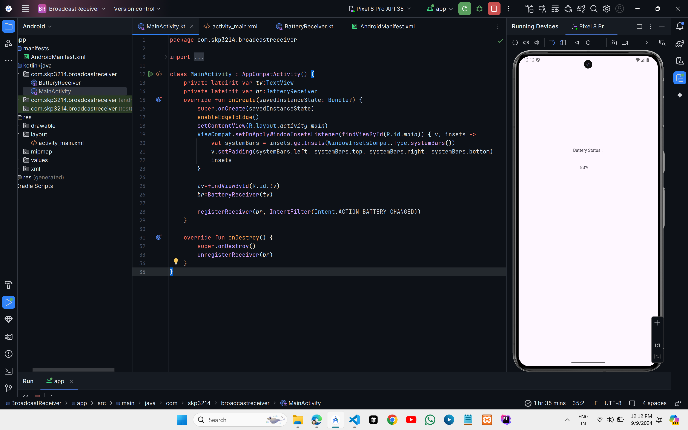

# BroadCast Receiver (Accessing Battery Status)

## XML CODE

### `activity_main.xml`
```xml
<?xml version="1.0" encoding="utf-8"?>
<androidx.constraintlayout.widget.ConstraintLayout xmlns:android="http://schemas.android.com/apk/res/android"
    xmlns:app="http://schemas.android.com/apk/res-auto"
    xmlns:tools="http://schemas.android.com/tools"
    android:id="@+id/main"
    android:layout_width="match_parent"
    android:layout_height="match_parent"
    tools:context=".MainActivity">

    <TextView
        android:id="@+id/textView2"
        android:layout_width="wrap_content"
        android:layout_height="wrap_content"
        android:layout_marginTop="268dp"
        android:text="Battery Status :"
        app:layout_constraintEnd_toEndOf="parent"
        app:layout_constraintHorizontal_bias="0.498"
        app:layout_constraintStart_toStartOf="parent"
        app:layout_constraintTop_toTopOf="parent" />

    <TextView
        android:id="@+id/tv"
        android:layout_width="wrap_content"
        android:layout_height="wrap_content"
        android:text="TextView"
        app:layout_constraintBottom_toBottomOf="parent"
        app:layout_constraintEnd_toEndOf="parent"
        app:layout_constraintHorizontal_bias="0.47"
        app:layout_constraintStart_toStartOf="parent"
        app:layout_constraintTop_toBottomOf="@+id/textView2"
        app:layout_constraintVertical_bias="0.056" />


</androidx.constraintlayout.widget.ConstraintLayout>
```

## Kotlin Code

### `MainActivity.kt`
```kt
import android.content.Intent
import android.content.IntentFilter
import android.os.Bundle
import android.widget.TextView
import androidx.activity.enableEdgeToEdge
import androidx.appcompat.app.AppCompatActivity
import androidx.core.view.ViewCompat
import androidx.core.view.WindowInsetsCompat

class MainActivity : AppCompatActivity() {
    private lateinit var tv:TextView
    private lateinit var br:BatteryReceiver
    override fun onCreate(savedInstanceState: Bundle?) {
        super.onCreate(savedInstanceState)
        enableEdgeToEdge()
        setContentView(R.layout.activity_main)
        ViewCompat.setOnApplyWindowInsetsListener(findViewById(R.id.main)) { v, insets ->
            val systemBars = insets.getInsets(WindowInsetsCompat.Type.systemBars())
            v.setPadding(systemBars.left, systemBars.top, systemBars.right, systemBars.bottom)
            insets
        }

        tv=findViewById(R.id.tv)
        br=BatteryReceiver(tv)

        registerReceiver(br, IntentFilter(Intent.ACTION_BATTERY_CHANGED))
    }

    override fun onDestroy() {
        super.onDestroy()
        unregisterReceiver(br)
    }
}
```

### `BatteryReceiver.kt`

```kt
import android.content.BroadcastReceiver
import android.content.Context
import android.content.Intent
import android.os.BatteryManager
import android.widget.TextView
import android.widget.Toast

class BatteryReceiver(private var tv: TextView):BroadcastReceiver() {
    override fun onReceive(context: Context, intent: Intent?) {
        val perc= intent?.getIntExtra("level",0)
        if(perc!=0){
            "$perc%".also { tv.text = it }
        }
        val batteryStatus: Int? = intent?.getIntExtra(BatteryManager.EXTRA_STATUS,0)
        val isCharging:Boolean=batteryStatus==BatteryManager.BATTERY_STATUS_CHARGING || batteryStatus==BatteryManager.BATTERY_STATUS_FULL

        if(isCharging){
            Toast.makeText(context,"Charger Connected",Toast.LENGTH_LONG).show()
        }
        else{
            Toast.makeText(context,"Charger Disconnected",Toast.LENGTH_LONG).show()
        }
    }

}
```