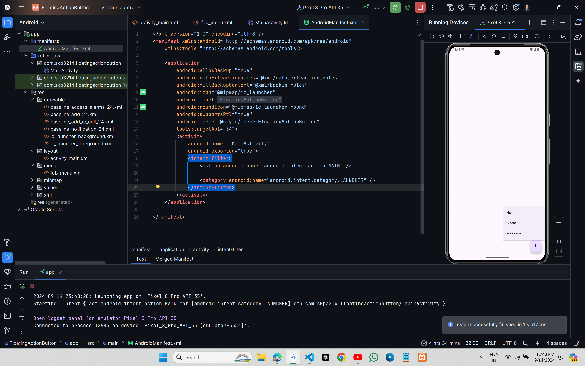

# Floating Action Button



## XML Code

### `activity_main.xml`

```xml
<?xml version="1.0" encoding="utf-8"?>
<androidx.constraintlayout.widget.ConstraintLayout xmlns:android="http://schemas.android.com/apk/res/android"
    xmlns:app="http://schemas.android.com/apk/res-auto"
    xmlns:tools="http://schemas.android.com/tools"
    android:id="@+id/main"
    android:layout_width="match_parent"
    android:layout_height="match_parent"
    tools:context=".MainActivity">

    <com.google.android.material.floatingactionbutton.FloatingActionButton
        android:layout_width="wrap_content"
        android:layout_height="wrap_content"
        android:layout_margin="16dp"
        android:id="@+id/fab"
        android:src="@drawable/baseline_add_24"
        android:contentDescription="Main FAB"
        app:layout_constraintBottom_toBottomOf="parent"
        app:layout_constraintEnd_toEndOf="parent"

        />

</androidx.constraintlayout.widget.ConstraintLayout>
```
### `fab_menu.xml`

```xml
<?xml version="1.0" encoding="utf-8"?>
<menu xmlns:android="http://schemas.android.com/apk/res/android"
    xmlns:app="http://schemas.android.com/apk/res-auto">
    <item
        android:id="@+id/action_item1"
        android:title="Notification"
        android:icon="@drawable/baseline_notification_24"
        app:showAsAction="ifRoom"
        />
    <item
        android:id="@+id/action_item2"
        android:title="Alarm"
        android:icon="@drawable/baseline_access_alarms_24"
        app:showAsAction="ifRoom"
        />
    <item
        android:id="@+id/action_item3"
        android:title="Message"
        android:icon="@drawable/baseline_add_ic_call_24"
        app:showAsAction="ifRoom"
        />
</menu>
```

## Kotlin Code

### `MainActivity.kt`

```kt
package com.skp3214.floatingactionbutton

import android.os.Bundle
import android.view.View
import android.widget.Toast
import androidx.activity.enableEdgeToEdge
import androidx.appcompat.app.AppCompatActivity
import androidx.appcompat.widget.PopupMenu
import androidx.core.view.ViewCompat
import androidx.core.view.WindowInsetsCompat
import com.google.android.material.floatingactionbutton.FloatingActionButton

class MainActivity : AppCompatActivity() {
    override fun onCreate(savedInstanceState: Bundle?) {
        super.onCreate(savedInstanceState)
        enableEdgeToEdge()
        setContentView(R.layout.activity_main)
        ViewCompat.setOnApplyWindowInsetsListener(findViewById(R.id.main)) { v, insets ->
            val systemBars = insets.getInsets(WindowInsetsCompat.Type.systemBars())
            v.setPadding(systemBars.left, systemBars.top, systemBars.right, systemBars.bottom)
            insets
        }
        val fab:FloatingActionButton=findViewById(R.id.fab)
        fab.setOnClickListener { view->
            showPopupMenu(view)
        }
    }

    private fun showPopupMenu(view: View) {
        val popupMenu = PopupMenu(this, view)
        popupMenu.menuInflater.inflate(R.menu.fab_menu, popupMenu.menu)
        try {
            val fields = popupMenu::class.java.declaredFields
            for (field in fields) {
                if ("mPopup" == field.name) {
                    field.isAccessible = true
                    val menuPopupHelper = field.get(popupMenu)
                    val classPopupHelper = Class.forName(menuPopupHelper.javaClass.name)
                    val setForceIcons = classPopupHelper.getMethod("setForceShowIcon", Boolean::class.javaPrimitiveType)
                    setForceIcons.invoke(menuPopupHelper, true)
                    break
                }
            }
        } catch (e: Exception) {
            e.printStackTrace()
        }

        popupMenu.setOnMenuItemClickListener { item ->
            when (item.itemId) {
                R.id.action_item1 -> {
                    Toast.makeText(this, "Notification", Toast.LENGTH_SHORT).show()
                    true
                }
                R.id.action_item2 -> {
                    Toast.makeText(this, "Alarm", Toast.LENGTH_SHORT).show()
                    true
                }
                R.id.action_item3 -> {
                    Toast.makeText(this, "Message", Toast.LENGTH_SHORT).show()
                    true
                }
                else -> false
            }
        }
        popupMenu.show()
    }
}
```