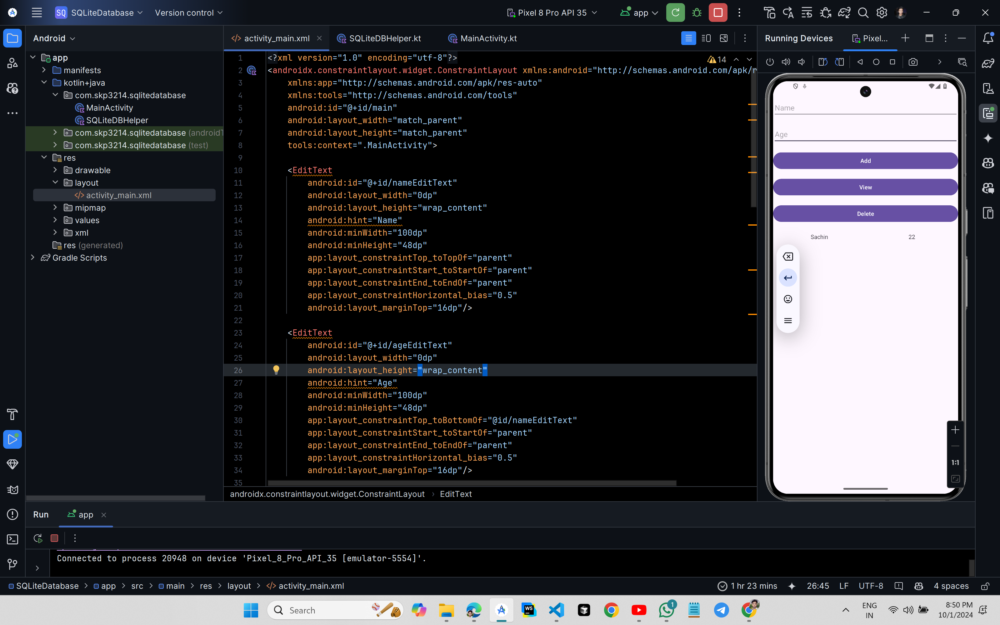

# SQLiteDatabase Example



## XML Code

### `activity_main.xml`
```xml
<?xml version="1.0" encoding="utf-8"?>
<androidx.constraintlayout.widget.ConstraintLayout xmlns:android="http://schemas.android.com/apk/res/android"
    xmlns:app="http://schemas.android.com/apk/res-auto"
    xmlns:tools="http://schemas.android.com/tools"
    android:id="@+id/main"
    android:layout_width="match_parent"
    android:layout_height="match_parent"
    tools:context=".MainActivity">

    <EditText
        android:id="@+id/nameEditText"
        android:layout_width="0dp"
        android:layout_height="wrap_content"
        android:hint="Name"
        android:minWidth="100dp"
        android:minHeight="48dp"
        app:layout_constraintTop_toTopOf="parent"
        app:layout_constraintStart_toStartOf="parent"
        app:layout_constraintEnd_toEndOf="parent"
        app:layout_constraintHorizontal_bias="0.5"
        android:layout_marginTop="16dp"/>

    <EditText
        android:id="@+id/ageEditText"
        android:layout_width="0dp"
        android:layout_height="wrap_content"
        android:hint="Age"
        android:minWidth="100dp"
        android:minHeight="48dp"
        app:layout_constraintTop_toBottomOf="@id/nameEditText"
        app:layout_constraintStart_toStartOf="parent"
        app:layout_constraintEnd_toEndOf="parent"
        app:layout_constraintHorizontal_bias="0.5"
        android:layout_marginTop="16dp"/>

    <Button
        android:id="@+id/addButton"
        android:layout_width="0dp"
        android:layout_height="wrap_content"
        android:text="Add"
        app:layout_constraintTop_toBottomOf="@id/ageEditText"
        app:layout_constraintStart_toStartOf="parent"
        app:layout_constraintEnd_toEndOf="parent"
        app:layout_constraintHorizontal_bias="0.5"
        android:layout_marginTop="16dp"/>

    <Button
        android:id="@+id/viewButton"
        android:layout_width="0dp"
        android:layout_height="wrap_content"
        android:text="View"
        app:layout_constraintTop_toBottomOf="@id/addButton"
        app:layout_constraintStart_toStartOf="parent"
        app:layout_constraintEnd_toEndOf="parent"
        app:layout_constraintHorizontal_bias="0.5"
        android:layout_marginTop="16dp"/>

    <Button
        android:id="@+id/deleteButton"
        android:layout_width="0dp"
        android:layout_height="wrap_content"
        android:text="Delete"
        app:layout_constraintTop_toBottomOf="@id/viewButton"
        app:layout_constraintStart_toStartOf="parent"
        app:layout_constraintEnd_toEndOf="parent"
        app:layout_constraintHorizontal_bias="0.5"
        android:layout_marginTop="16dp"/>

    <TextView
        android:id="@+id/Name"
        android:layout_width="0dp"
        android:layout_height="wrap_content"
        android:layout_marginTop="16dp"
        android:minWidth="100dp"
        android:minHeight="48dp"
        android:gravity="center"
        android:text=""
        app:layout_constraintEnd_toStartOf="@id/Age"
        app:layout_constraintHorizontal_bias="0.5"
        app:layout_constraintStart_toStartOf="parent"
        app:layout_constraintTop_toBottomOf="@id/deleteButton" />

    <TextView
        android:id="@+id/Age"
        android:layout_width="0dp"
        android:layout_height="wrap_content"
        android:layout_marginTop="16dp"
        android:minWidth="100dp"
        android:minHeight="48dp"
        android:gravity="center"
        android:text=""
        app:layout_constraintEnd_toEndOf="parent"
        app:layout_constraintHorizontal_bias="0.5"
        app:layout_constraintStart_toEndOf="@id/Name"
        app:layout_constraintTop_toBottomOf="@id/deleteButton" />


</androidx.constraintlayout.widget.ConstraintLayout>
```

## Kotlin Code

### `SQLiteDBHelper.kt`
```kt
package com.skp3214.sqlitedatabase

import android.content.ContentValues
import android.content.Context
import android.database.Cursor
import android.database.sqlite.SQLiteDatabase
import android.database.sqlite.SQLiteOpenHelper

class SQLiteDBHelper(context: Context, factory: SQLiteDatabase.CursorFactory?) :
    SQLiteOpenHelper(context, DATABASE_NAME, factory, DATABASE_VERSION) {

    override fun onCreate(db: SQLiteDatabase?) {
        val query = ("CREATE TABLE " + TABLE_NAME +
                " (" + ID_COL + " INTEGER PRIMARY KEY, " +
                NAME_COL + " TEXT, " +
                AGE_COL + " TEXT" + ")")
        db?.execSQL(query)
    }

    override fun onUpgrade(db: SQLiteDatabase?, oldVersion: Int, newVersion: Int) {
        db?.execSQL("DROP TABLE IF EXISTS $TABLE_NAME")
        onCreate(db)
    }

    fun addName(name: String, age: String) {
        val values = ContentValues()
        values.put(NAME_COL, name)
        values.put(AGE_COL, age)

        val db = this.writableDatabase
        db.insert(TABLE_NAME, null, values)
        db.close()
    }

    fun getName(): Cursor? {
        val db = this.readableDatabase
        return db.rawQuery("SELECT * FROM $TABLE_NAME", null)
    }

    fun delAll() {
        val db = this.writableDatabase
        db.execSQL("DELETE FROM $TABLE_NAME")
        db.close()
    }

    companion object {
        private const val DATABASE_NAME = "CSE_226_SQL"
        private const val DATABASE_VERSION = 1
        private const val TABLE_NAME = "CSE_226_TABLE"
        private const val ID_COL = "ID"
        private const val NAME_COL = "NAME"
        private const val AGE_COL = "AGE"
    }
}
```
### `MainActivity.kt`

```kt
package com.skp3214.sqlitedatabase

import android.os.Bundle
import android.widget.Button
import android.widget.EditText
import android.widget.TextView
import androidx.activity.enableEdgeToEdge
import androidx.appcompat.app.AppCompatActivity
import androidx.core.view.ViewCompat
import androidx.core.view.WindowInsetsCompat

class MainActivity : AppCompatActivity() {
    override fun onCreate(savedInstanceState: Bundle?) {
        super.onCreate(savedInstanceState)
        enableEdgeToEdge()
        setContentView(R.layout.activity_main)
        ViewCompat.setOnApplyWindowInsetsListener(findViewById(R.id.main)) { v, insets ->
            val systemBars = insets.getInsets(WindowInsetsCompat.Type.systemBars())
            v.setPadding(systemBars.left, systemBars.top, systemBars.right, systemBars.bottom)
            insets
        }

        val name = findViewById<EditText>(R.id.nameEditText)
        val age = findViewById<EditText>(R.id.ageEditText)
        val nameTextView = findViewById<TextView>(R.id.Name)
        val ageTextView = findViewById<TextView>(R.id.Age)
        val addButton = findViewById<Button>(R.id.addButton)
        val viewButton = findViewById<Button>(R.id.viewButton)
        val deleteButton = findViewById<Button>(R.id.deleteButton)
        val db = SQLiteDBHelper(this, null)

        deleteButton.setOnClickListener {
            db.delAll()
            viewData(db, nameTextView, ageTextView)
        }
        addButton.setOnClickListener {
            db.addName(name.text.toString(), age.text.toString())
            name.text.clear()
            age.text.clear()
            viewData(db, nameTextView, ageTextView)
        }
        viewButton.setOnClickListener {
            viewData(db, nameTextView, ageTextView)
        }

    }

    private fun viewData(db: SQLiteDBHelper, nameTextView: TextView?, ageTextView: TextView?) {
        val cursor = db.getName()
        nameTextView!!.text = ""
        ageTextView!!.text = ""
        while (cursor?.moveToNext() == true) {
            nameTextView.append(cursor.getString(1) + "\n")
            ageTextView.append(cursor.getString(2) + "\n")
        }
        cursor?.close()
    }
}
```
