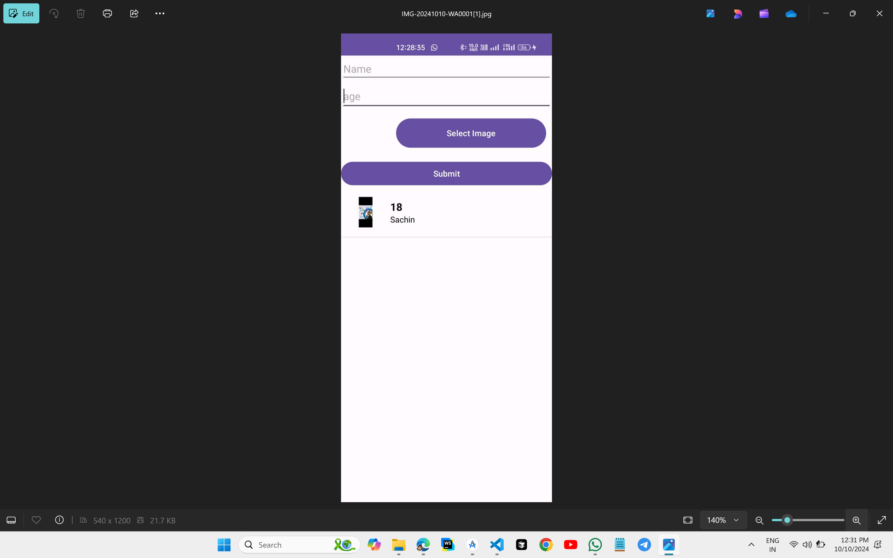

# Custom List View Using SQLite Database

## Preview

## XML CODE

### `activity_main.xml`
```xml
<?xml version="1.0" encoding="utf-8"?>
<LinearLayout xmlns:android="http://schemas.android.com/apk/res/android"
    android:layout_width="match_parent"
    android:layout_height="match_parent"
    xmlns:tools="http://schemas.android.com/tools"
    android:orientation="vertical"
    tools:context=".MainActivity">
    <EditText
        android:layout_width="match_parent"
        android:layout_height="wrap_content"
        android:id="@+id/et1"
        android:hint="Name"
        />

    <EditText
        android:id="@+id/et2"
        android:layout_width="match_parent"
        android:layout_height="wrap_content"
        android:hint="age"
        android:minHeight="48dp" />
    <LinearLayout
        android:layout_width="match_parent"
        android:layout_height="wrap_content"
        android:orientation="horizontal"
        >
        <ImageView
            android:id="@+id/imageView"
            android:layout_width="84dp"
            android:layout_height="84dp"
            android:padding="16dp"
            tools:ignore="ContentDescription" />
        <Button
            android:layout_width="match_parent"
            android:layout_height="58dp"
            android:layout_margin="10dp"
            android:text="Select Image"
            android:id="@+id/select"
            />
    </LinearLayout>
    <Button
        android:layout_width="match_parent"
        android:layout_height="wrap_content"
        android:text="Submit"
        android:id="@+id/add"
        />
    <ListView
        android:id="@+id/listView"
        android:layout_width="match_parent"
        android:layout_height="match_parent"
        />

</LinearLayout>
```
### `custom_list_view.xml`
```xml
<?xml version="1.0" encoding="utf-8"?>
<LinearLayout
    xmlns:android="http://schemas.android.com/apk/res/android"
    xmlns:tools="http://schemas.android.com/tools"
    android:layout_width="match_parent"
    android:layout_height="wrap_content"
    android:orientation="horizontal"

    tools:ignore="UselessParent">

    <ImageView
        android:id="@+id/imageView"
        android:layout_width="84dp"
        android:layout_height="84dp"
        android:padding="16dp"
        tools:ignore="ContentDescription" />

    <LinearLayout
        android:layout_width="match_parent"
        android:layout_height="match_parent"
        android:gravity="center_vertical"
        android:orientation="vertical">

        <TextView
            android:id="@+id/textView1"
            android:layout_width="match_parent"
            android:layout_height="wrap_content"
            android:layout_marginTop="16dp"
            android:gravity="bottom|left"
            android:textColor="@android:color/black"
            android:textSize="18sp"
            android:textStyle="bold"
            tools:ignore="RtlHardcoded" />

        <TextView
            android:id="@+id/textView2"
            android:layout_width="match_parent"
            android:layout_height="wrap_content"
            android:layout_marginBottom="16dp"
            android:gravity="top|left"
            android:textColor="@android:color/black"
            android:textSize="14sp"
            tools:ignore="RtlHardcoded" />

    </LinearLayout>

</LinearLayout>
```
## KOTLIN CODE
### `MainActivity.kt`
```kt
package com.skp3214.myapplication

import android.net.Uri
import android.os.Bundle
import android.widget.Button
import android.widget.EditText
import android.widget.ImageView
import android.widget.ListView
import android.widget.Toast
import androidx.activity.result.contract.ActivityResultContracts
import androidx.appcompat.app.AlertDialog
import androidx.appcompat.app.AppCompatActivity
import androidx.core.graphics.drawable.toBitmap

class MainActivity : AppCompatActivity() {
    private lateinit var imageUri: Uri
    override fun onCreate(savedInstanceState: Bundle?) {
        super.onCreate(savedInstanceState)
        setContentView(R.layout.activity_main)
        val listView = findViewById<ListView>(R.id.listView)
        val nameText = findViewById<EditText>(R.id.et1)
        val ageText = findViewById<EditText>(R.id.et2)
        val select = findViewById<Button>(R.id.select)
        val selectedImage = findViewById<ImageView>(R.id.imageView)
        val submit = findViewById<Button>(R.id.add)
        val list = mutableListOf<Model>()
        val db = SQLiteDBHelper(this, null)

        val imageRepository = ImageRepository(resources)

        showSelectedImage(selectedImage,select)

        loadAllDataFromDatabase(list,db, imageRepository)

        val ad = CustomListViewAdapter(this, list)
        listView.adapter = ad

        submit.setOnClickListener {
            val digit = ageText.text.toString().toIntOrNull()
            val text = nameText.text.toString()
            val image = imageRepository.bitmapToByteArray(selectedImage.drawable.toBitmap())
            if (digit != null && text.isNotEmpty()) {
                db.addName(text, digit, image)
                loadAllDataFromDatabase(list, db, imageRepository)
                ad.notifyDataSetChanged()
                nameText.text.clear()
                ageText.text.clear()
                selectedImage.setImageResource(0)
            } else {
                Toast.makeText(this, "Please enter valid data", Toast.LENGTH_SHORT).show()
            }
        }

        listView.setOnItemClickListener { _, _, position, _ ->
            AlertDialog.Builder(this)
                .setTitle("Confirm Deletion")
                .setPositiveButton("Delete") { dialog, _ ->
                    val id = list[position].id
                    db.delItemByID(id)
                    loadAllDataFromDatabase(list, db, imageRepository)
                    ad.notifyDataSetChanged()
                    Toast.makeText(this, "Deleted", Toast.LENGTH_SHORT).show()
                    dialog.dismiss()
                }
                .setNegativeButton("Cancel") { dialog, _ ->
                    dialog.dismiss()
                }
                .show()
        }
    }

    private fun loadAllDataFromDatabase(list: MutableList<Model>, db: SQLiteDBHelper, imageRepository: ImageRepository) {
        list.clear()
        val cursor = db.getData()
        cursor?.let {
            while (it.moveToNext()) {
                val id = it.getInt(it.getColumnIndexOrThrow(SQLiteDBHelper.ID_COL))
                val digit = it.getInt(it.getColumnIndexOrThrow(SQLiteDBHelper.DIGIT_COL))
                val text = it.getString(it.getColumnIndexOrThrow(SQLiteDBHelper.TEXT_COL))
                val image = it.getBlob(it.getColumnIndexOrThrow(SQLiteDBHelper.IMAGE_COL))
                val bitmap = imageRepository.byteArrayToBitmap(image)
                list.add(Model(bitmap, id ,digit.toString(), text))
            }
            it.close()
        }
    }

    private fun showSelectedImage(selectedImage: ImageView,select: Button) {
        val getImage = registerForActivityResult(ActivityResultContracts.GetContent()) { uri ->
            uri?.let {
                imageUri = it
                selectedImage.setImageURI(it)
            }
        }
        select.setOnClickListener {
            getImage.launch("image/*")
        }
    }
}
```
### `CustomListViewAdapter.kt`
```kt
package com.skp3214.myapplication

import android.content.Context
import android.view.LayoutInflater
import android.view.View
import android.view.ViewGroup
import android.widget.BaseAdapter
import android.widget.ImageView
import android.widget.TextView

class CustomListViewAdapter(context: Context, private val arrayList: MutableList<Model>) : BaseAdapter() {

    private val inflater: LayoutInflater = LayoutInflater.from(context)

    override fun getCount(): Int {return arrayList.size
    }

    override fun getItem(position: Int): Model {
        return arrayList[position]
    }

    override fun getItemId(position: Int): Long {
        return position.toLong()
    }

    override fun getView(position: Int, convertView: View?, parent: ViewGroup): View {
        val view: View = convertView ?: inflater.inflate(R.layout.custom_list_view, parent, false)

        val currentNumberPosition = getItem(position)
        val numbersImage = view.findViewById<ImageView>(R.id.imageView)
        numbersImage.setImageBitmap(currentNumberPosition.image)

        val textView1 = view.findViewById<TextView>(R.id.textView1)
        textView1.text = currentNumberPosition.numberInDigit

        val textView2 = view.findViewById<TextView>(R.id.textView2)
        textView2.text = currentNumberPosition.numbersInText

        return view
    }
}
```
### `Model.kt`
```kt
package com.skp3214.myapplication
import android.graphics.Bitmap

class Model(val image: Bitmap, val id:Int, val numberInDigit: String, val numbersInText: String)
```
### `ImageRepository.kt`
```kt
package com.skp3214.myapplication

import android.content.res.Resources
import android.graphics.Bitmap
import android.graphics.BitmapFactory

import java.io.ByteArrayOutputStream

class ImageRepository(private val resources: Resources) {

    fun bitmapToByteArray(bitmap: Bitmap): ByteArray {
        val stream = ByteArrayOutputStream()
        bitmap.compress(Bitmap.CompressFormat.JPEG, 90, stream) // Use compression quality of 90
        return stream.toByteArray()
    }

    fun byteArrayToBitmap(byteArray: ByteArray): Bitmap {
        val options = BitmapFactory.Options()
        options.inJustDecodeBounds = true
        BitmapFactory.decodeByteArray(byteArray, 0, byteArray.size, options)

        // Calculate inSampleSize
        options.inSampleSize = calculateInSampleSize(options, reqWidth, reqHeight)

        options.inJustDecodeBounds = false
        return BitmapFactory.decodeByteArray(byteArray, 0, byteArray.size, options)
    }

    private val reqWidth: Int
        get() = resources.getDimensionPixelSize(android.R.dimen.thumbnail_width)

    private val reqHeight: Int
        get() = resources.getDimensionPixelSize(android.R.dimen.thumbnail_height)

    private fun calculateInSampleSize(options: BitmapFactory.Options, reqWidth: Int, reqHeight: Int): Int {
        val height = options.outHeight
        val width = options.outWidth
        var inSampleSize = 1

        if (height > reqHeight || width > reqWidth) {

            val halfHeight = height / 2
            val halfWidth = width / 2

            while (halfHeight / inSampleSize >= reqHeight && halfWidth / inSampleSize >= reqWidth) {
                inSampleSize *= 2
            }
        }
        return inSampleSize
    }
}
```
### `SQLiteDBHelper.kt`
```kt
package com.skp3214.myapplication

import android.content.ContentValues
import android.content.Context
import android.database.Cursor
import android.database.sqlite.SQLiteDatabase
import android.database.sqlite.SQLiteOpenHelper

class SQLiteDBHelper(context: Context, factory: SQLiteDatabase.CursorFactory?) :
    SQLiteOpenHelper(context, DATABASE_NAME, factory, DATABASE_VERSION) {

    override fun onCreate(db: SQLiteDatabase?) {
        val query = "CREATE TABLE $TABLE_NAME ($ID_COL INTEGER PRIMARY KEY AUTOINCREMENT, $DIGIT_COL INTEGER, $TEXT_COL TEXT, $IMAGE_COL BLOB)"
        db?.execSQL(query)
    }

    override fun onUpgrade(db: SQLiteDatabase?, oldVersion: Int, newVersion: Int) {
        db?.execSQL("DROP TABLE IF EXISTS $TABLE_NAME")
        onCreate(db)
    }

    fun addName(text: String, digit: Int, image: ByteArray) {
        val values = ContentValues()
        values.put(DIGIT_COL, digit)
        values.put(TEXT_COL, text)
        values.put(IMAGE_COL, image)
        val db = this.writableDatabase
        db.insert(TABLE_NAME, null, values)
        db.close()
    }
    
    fun getData(): Cursor? {
        val db = this.readableDatabase
        return db.rawQuery("SELECT * FROM $TABLE_NAME", null)
    }

    fun delItemByID(id: Int) {
        val db = this.writableDatabase
        db.execSQL("DELETE FROM $TABLE_NAME WHERE $ID_COL = $id")
        db.close()
    }

    companion object {
        const val DATABASE_NAME = "ModelDB"
        const val DATABASE_VERSION = 2
        const val TABLE_NAME = "ModelTable"
        const val ID_COL = "ID"
        const val DIGIT_COL = "DIGIT"
        const val TEXT_COL = "TEXT"
        const val IMAGE_COL="IMAGE"
    }
}
```