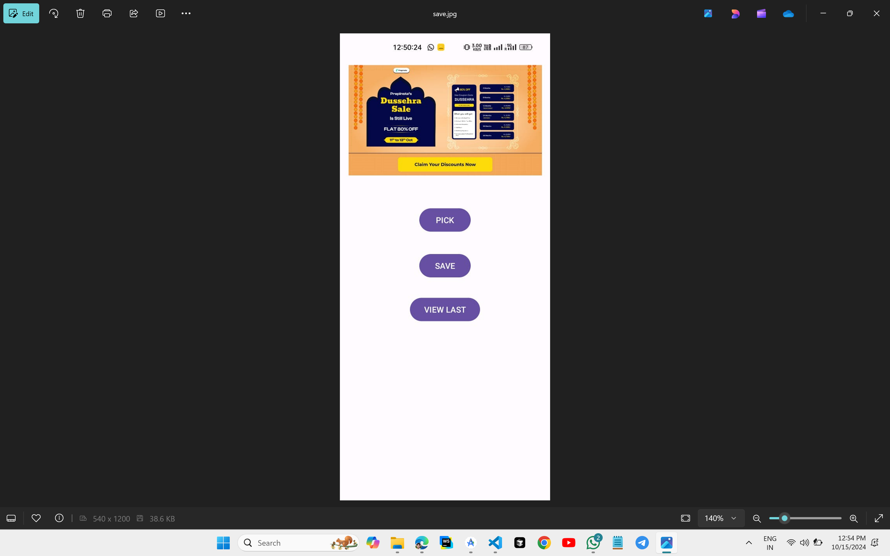
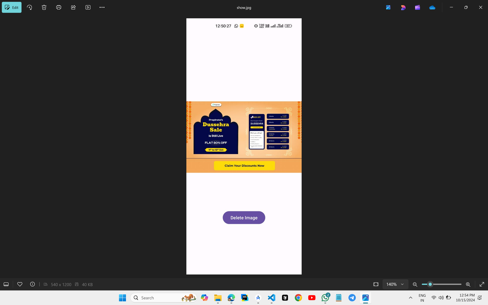
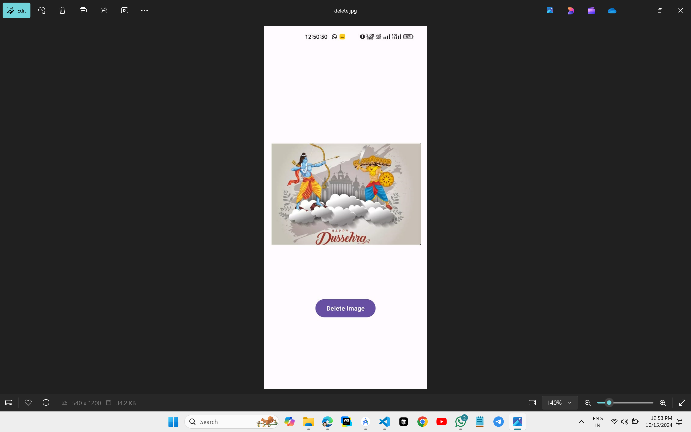

# Fetching Data From SQLiteDatabase to Next Activity



## XML CODE

### `activity_main.xml`
```xml
<?xml version="1.0" encoding="utf-8"?>
<androidx.constraintlayout.widget.ConstraintLayout xmlns:android="http://schemas.android.com/apk/res/android"
    xmlns:app="http://schemas.android.com/apk/res-auto"
    xmlns:tools="http://schemas.android.com/tools"
    android:id="@+id/main"
    android:layout_width="match_parent"
    android:layout_height="match_parent"
    tools:context=".MainActivity">

    <Button
        android:id="@+id/button1"
        android:layout_width="wrap_content"
        android:layout_height="wrap_content"
        android:text="PICK"
        app:layout_constraintBottom_toBottomOf="parent"
        app:layout_constraintEnd_toEndOf="parent"
        app:layout_constraintStart_toStartOf="parent"
        app:layout_constraintTop_toTopOf="parent"
        app:layout_constraintVertical_bias="0.361" />

    <Button
        android:id="@+id/button2"
        android:layout_width="wrap_content"
        android:layout_height="wrap_content"
        android:text="SAVE"
        app:layout_constraintBottom_toBottomOf="parent"
        app:layout_constraintEnd_toEndOf="parent"
        app:layout_constraintStart_toStartOf="parent"
        app:layout_constraintTop_toTopOf="parent"
        app:layout_constraintVertical_bias="0.471" />

    <Button
        android:id="@+id/button3"
        android:layout_width="wrap_content"
        android:layout_height="wrap_content"
        android:text="VIEW LAST"
        app:layout_constraintBottom_toBottomOf="parent"
        app:layout_constraintEnd_toEndOf="parent"
        app:layout_constraintStart_toStartOf="parent"
        app:layout_constraintTop_toTopOf="parent"
        app:layout_constraintVertical_bias="0.576" />

    <ImageView
        android:id="@+id/imageView1"
        android:layout_width="393dp"
        android:layout_height="189dp"
        app:layout_constraintBottom_toBottomOf="parent"
        app:layout_constraintEnd_toEndOf="parent"
        app:layout_constraintStart_toStartOf="parent"
        app:layout_constraintTop_toTopOf="parent"
        app:layout_constraintVertical_bias="0.029"
        tools:srcCompat="@tools:sample/avatars" />

</androidx.constraintlayout.widget.ConstraintLayout>
```
### `activity_image.xml`
```xml
<?xml version="1.0" encoding="utf-8"?>
<androidx.constraintlayout.widget.ConstraintLayout xmlns:android="http://schemas.android.com/apk/res/android"
    xmlns:app="http://schemas.android.com/apk/res-auto"
    xmlns:tools="http://schemas.android.com/tools"
    android:id="@+id/main"
    android:layout_width="match_parent"
    android:layout_height="match_parent"
    tools:context=".ImageActivity">

    <ImageView
        android:id="@+id/savedImage"
        android:layout_width="396dp"
        android:layout_height="223dp"
        app:layout_constraintBottom_toBottomOf="parent"
        app:layout_constraintEnd_toEndOf="parent"
        app:layout_constraintHorizontal_bias="0.466"
        app:layout_constraintStart_toStartOf="parent"
        app:layout_constraintTop_toTopOf="parent"
        app:layout_constraintVertical_bias="0.411"
        tools:srcCompat="@tools:sample/avatars" />

    <Button
        android:id="@+id/button"
        android:layout_width="wrap_content"
        android:layout_height="wrap_content"
        android:layout_marginTop="116dp"
        android:text="Delete Image"
        app:layout_constraintEnd_toEndOf="parent"
        app:layout_constraintStart_toStartOf="parent"
        app:layout_constraintTop_toBottomOf="@+id/savedImage" />

</androidx.constraintlayout.widget.ConstraintLayout>
```

## KOTLIN CODE

### `MainActivity.kt`
```kt
package com.skp3214.imagesqlite

import android.content.Intent
import android.graphics.Bitmap
import android.graphics.ImageDecoder
import android.net.Uri
import android.os.Bundle
import android.widget.Button
import android.widget.ImageView
import android.widget.Toast
import androidx.activity.enableEdgeToEdge
import androidx.activity.result.ActivityResultLauncher
import androidx.activity.result.contract.ActivityResultContracts
import androidx.appcompat.app.AppCompatActivity
import androidx.core.view.ViewCompat
import androidx.core.view.WindowInsetsCompat

class MainActivity : AppCompatActivity() {
    private lateinit var pick: Button
    private lateinit var save: Button
    private lateinit var viewImage: Button
    private lateinit var pickedImage: ImageView
    private lateinit var getImage: ActivityResultLauncher<String>
    private var selectedBitmap: Bitmap? = null
    private lateinit var imageUri: Uri
    private lateinit var imageRepository: ImageRepository

    override fun onCreate(savedInstanceState: Bundle?) {
        super.onCreate(savedInstanceState)
        enableEdgeToEdge()
        setContentView(R.layout.activity_main)
        ViewCompat.setOnApplyWindowInsetsListener(findViewById(R.id.main)) { v, insets ->
            val systemBars = insets.getInsets(WindowInsetsCompat.Type.systemBars())
            v.setPadding(systemBars.left, systemBars.top, systemBars.right, systemBars.bottom)
            insets
        }

        pickedImage = findViewById(R.id.imageView1)
        pick = findViewById(R.id.button1)
        save = findViewById(R.id.button2)
        viewImage = findViewById(R.id.button3)
        val dbHelper = DatabaseHelper(this)
        imageRepository = ImageRepository(dbHelper)

        getImage = registerForActivityResult(ActivityResultContracts.GetContent()) { uri ->
            uri?.let {
                imageUri = it
                pickedImage.setImageURI(it)
            }
        }

        pick.setOnClickListener {
            getImage.launch("image/*")
        }

        save.setOnClickListener {
            if (::imageUri.isInitialized) {
                selectedBitmap = ImageDecoder.decodeBitmap(ImageDecoder.createSource(this.contentResolver, imageUri))
                selectedBitmap?.let {
                    imageRepository.insertImage(it)
                    Toast.makeText(this, "Image saved", Toast.LENGTH_SHORT).show()
                } ?: Toast.makeText(this, "No Image selected", Toast.LENGTH_SHORT).show()
            }
        }

        viewImage.setOnClickListener {
            val intent= Intent(this, ImageActivity::class.java)
            startActivity(intent)
        }
    }
}
```
### `ImageActivity.kt`
```kt
package com.skp3214.imagesqlite

import android.os.Bundle
import android.widget.Button
import android.widget.ImageView
import androidx.activity.enableEdgeToEdge
import androidx.appcompat.app.AppCompatActivity
import androidx.core.view.ViewCompat
import androidx.core.view.WindowInsetsCompat

class ImageActivity : AppCompatActivity() {
    override fun onCreate(savedInstanceState: Bundle?) {
        super.onCreate(savedInstanceState)
        enableEdgeToEdge()
        setContentView(R.layout.activity_image)
        ViewCompat.setOnApplyWindowInsetsListener(findViewById(R.id.main)) { v, insets ->
            val systemBars = insets.getInsets(WindowInsetsCompat.Type.systemBars())
            v.setPadding(systemBars.left, systemBars.top, systemBars.right, systemBars.bottom)
            insets
        }

        val savedImage=findViewById<ImageView>(R.id.savedImage)
        val deleteButton=findViewById<Button>(R.id.button)
        val db=DatabaseHelper(this)
        val imageRepository=ImageRepository(db)
        deleteButton.setOnClickListener {
            deleteImage(db, imageRepository, savedImage)
        }

        showLastSavedImage(imageRepository,savedImage)
    }
    private fun deleteImage(db:DatabaseHelper, imageRepository: ImageRepository, savedImage: ImageView) {
        db.deleteLastImage()
        showLastSavedImage(imageRepository, savedImage)
    }
    private fun showLastSavedImage(imageRepository: ImageRepository, savedImage: ImageView) {
        savedImage.setImageBitmap(imageRepository.getLastSavedImage())
    }
}
```
### `ImageRepository.kt`
```kt
package com.skp3214.imagesqlite

import android.graphics.Bitmap
import android.graphics.BitmapFactory
import java.io.ByteArrayOutputStream

class ImageRepository(private val databaseHelper: DatabaseHelper) {
    private fun bitmapToByteArray(bitmap: Bitmap): ByteArray {
        val stream = ByteArrayOutputStream()
        bitmap.compress(Bitmap.CompressFormat.PNG, 0, stream)
        return stream.toByteArray()
    }

    fun insertImage(bitmap: Bitmap) {
        databaseHelper.insertImage(bitmapToByteArray(bitmap))
    }

    fun getLastSavedImage(): Bitmap {
        val byteArray = databaseHelper.getLastSavedImage()
        return byteArrayToBitmap(byteArray)
    }

    private fun byteArrayToBitmap(byteArray: ByteArray): Bitmap {
        return BitmapFactory.decodeByteArray(byteArray, 0, byteArray.size)
    }
}
```
### `DatabaseHelper.kt`
```kt
package com.skp3214.imagesqlite

import android.content.ContentValues
import android.content.Context
import android.database.sqlite.SQLiteDatabase
import android.database.sqlite.SQLiteOpenHelper

class DatabaseHelper(context: Context) : SQLiteOpenHelper(context, DATABASE_NAME, null, DATABASE_VERSION) {
    companion object {
        const val DATABASE_NAME = "image.db"
        const val DATABASE_VERSION = 1
        const val TABLE_NAME = "image_table"
        const val COLUMN_ID = "id"
        const val COLUMN_IMAGE = "image"
    }

    override fun onCreate(p0: SQLiteDatabase?) {
        val createTable = "CREATE TABLE $TABLE_NAME ($COLUMN_ID INTEGER PRIMARY KEY AUTOINCREMENT, $COLUMN_IMAGE BLOB)"
        p0?.execSQL(createTable)
    }

    override fun onUpgrade(p0: SQLiteDatabase?, p1: Int, p2: Int) {
        p0?.execSQL("DROP TABLE IF EXISTS $TABLE_NAME")
        onCreate(p0)
    }

    fun insertImage(bitmapToByteArray: ByteArray) {
        val database = this.writableDatabase
        val contentValues = ContentValues()
        contentValues.put(COLUMN_IMAGE, bitmapToByteArray)
        database.insert(TABLE_NAME, null, contentValues)
        database.close()
    }

    fun getLastSavedImage(): ByteArray {
        val database = this.readableDatabase
        val cursor = database.query(TABLE_NAME, arrayOf(COLUMN_IMAGE), null, null, null, null, "$COLUMN_ID DESC", "1")
        cursor.moveToFirst()
        val image = cursor.getBlob(cursor.getColumnIndexOrThrow(COLUMN_IMAGE))
        cursor.close()
        database.close()
        return image
    }

    fun deleteLastImage() {
        val database = this.writableDatabase
        val cursor = database.query(TABLE_NAME, arrayOf(COLUMN_ID), null, null, null, null, "$COLUMN_ID DESC", "1")
        cursor.moveToFirst()
        val id = cursor.getInt(cursor.getColumnIndexOrThrow(COLUMN_ID))
        database.delete(TABLE_NAME, "$COLUMN_ID = $id", null)
        cursor.close()
        database.close()
    }
}
```